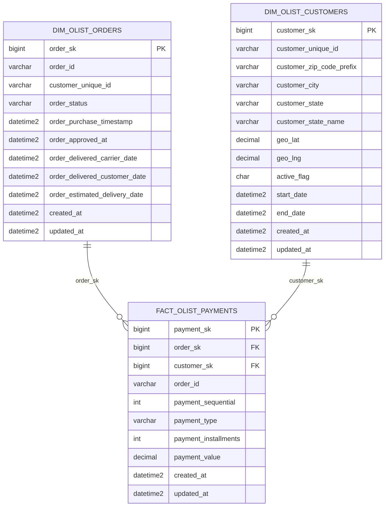
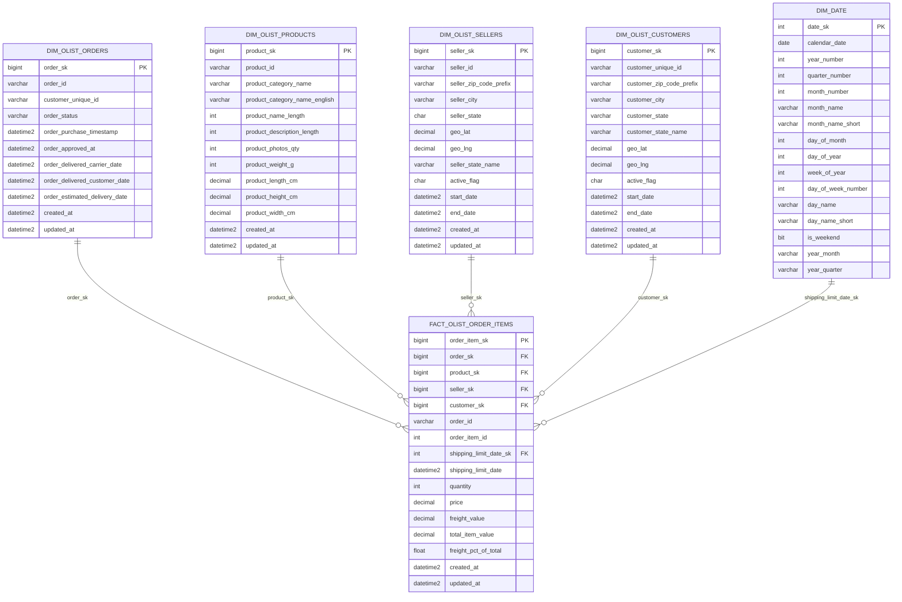
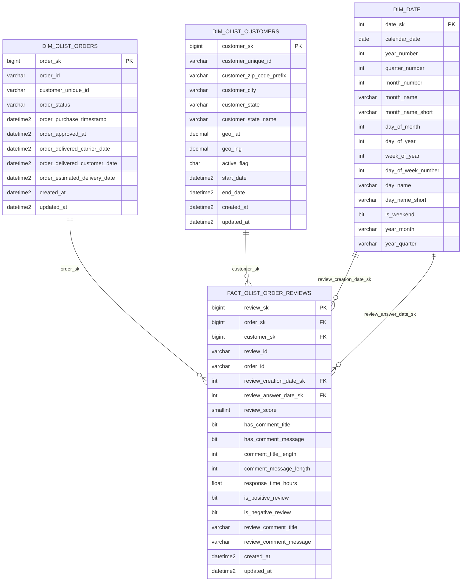
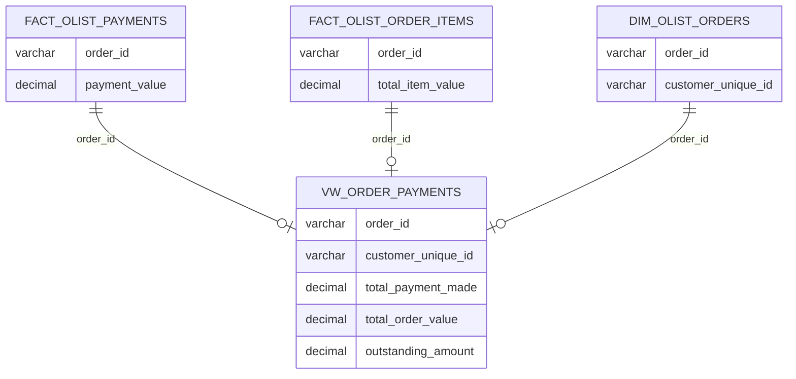
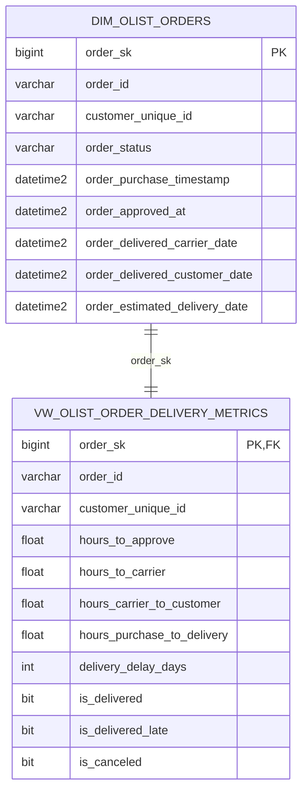
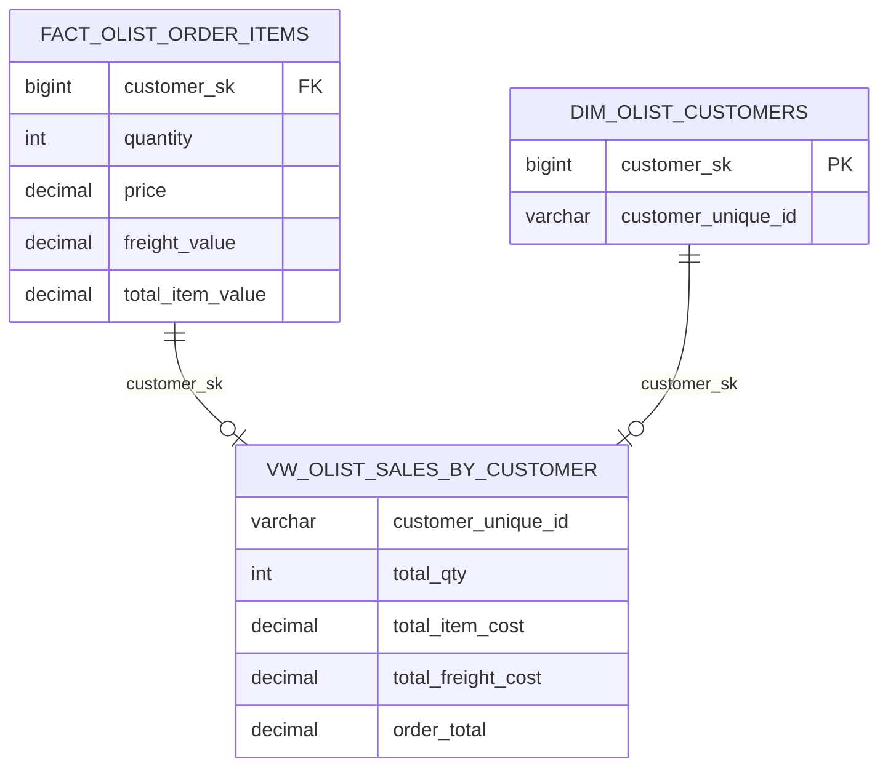
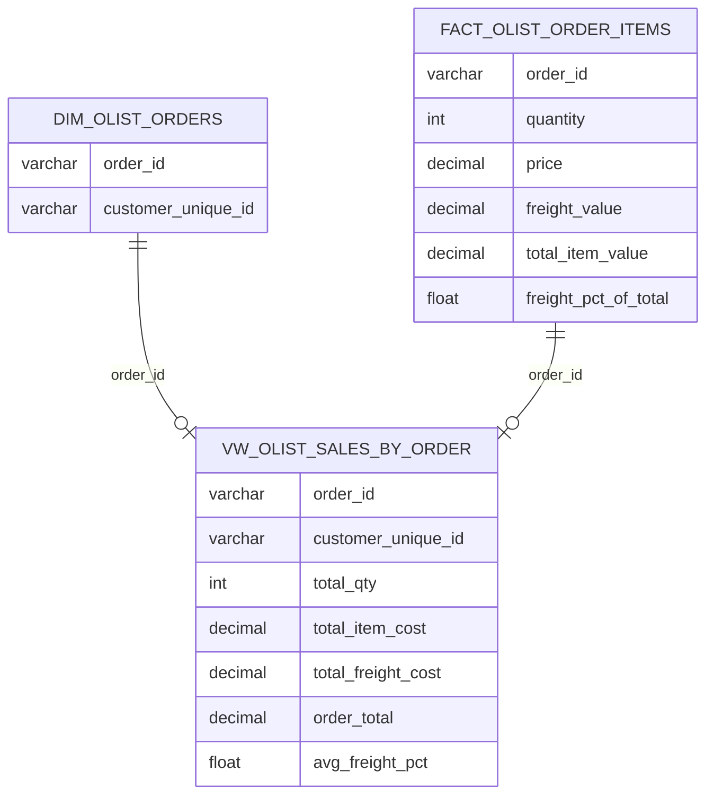

# Olist gold layer — datamart diagrams

Full-column star schema diagrams for the gold layer dimensional model: three fact tables, plus four reporting views built on top of them.

## 1. Payments datamart

## 2. Order items datamart

## 3. Order reviews datamart

## 4. `vw_order_payments` — order value vs. amount paid

Reconciles what an order was actually worth (summed from `fact_olist_order_items.total_item_value`) against what was actually paid for it (summed from `fact_olist_payments.payment_value`), surfacing any `outstanding_amount` gap between the two.

## 5. `vw_olist_order_delivery_metrics` — delivery performance

Computed directly on `dim_olist_orders` — no separate fact table needed, since these measures sit at the same 1:1 grain as the order itself.

## 6. `vw_olist_sales_by_customer` — sales rolled up per customer

`fact_olist_order_items` joined to `dim_olist_customers` via `customer_sk`, aggregated to one row per `customer_unique_id`.

## 7. `vw_olist_sales_by_order` — sales rolled up per order

`dim_olist_orders` joined to `fact_olist_order_items` on `order_id`, aggregated to one row per order, including the average freight cost as a percentage of order value.

