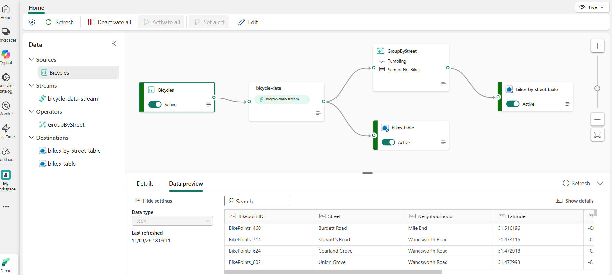
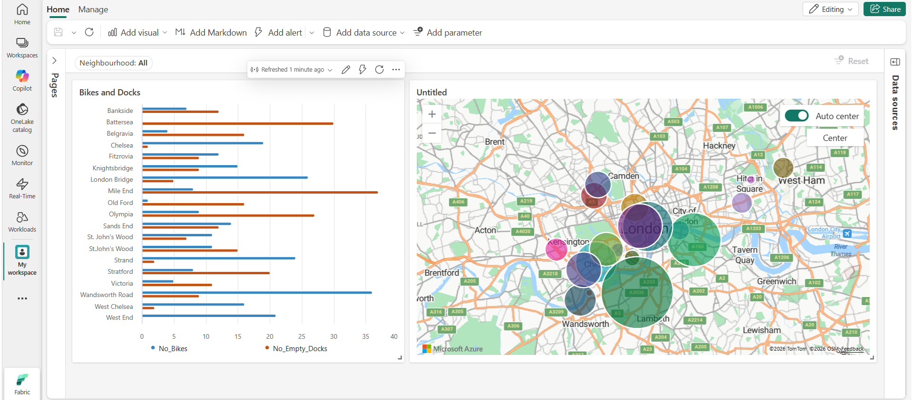

# Real-Time Bike Availability Streaming (Microsoft Fabric)

A no-code/low-code real-time solution built in **Microsoft Fabric Real-Time Intelligence** that streams London bike point data, stores the raw events, aggregates bike counts by street using a windowed operator, and visualises availability live on a **Real-Time Dashboard**.

## Architecture



```
Bicycles (source) → bicycle-data-stream → bikes-table (Eventhouse)
                                        └→ GroupByStreet → bikes-by-street-table (Eventhouse)
                                                                  ↓
                                                      Real-Time Dashboard
```

| Component | Type | Purpose |
|---|---|---|
| `Bicycles` | Eventstream source | Streams bike point data (location, bikes and empty docks) |
| `bicycle-data-stream` | Eventstream | Carries the incoming events |
| `GroupByStreet` | Operator (Group by) | Tumbling-window aggregation: sum of `No_Bikes` per street |
| `bikes-table` | Eventhouse destination | Stores the raw bike point events in the `bikes` table |
| `bikes-by-street-table` | Eventhouse destination | Stores the aggregated results in the `bikes-by-street` table |

## Data

Each event describes a bike point, with fields including:

| Field | Description |
|---|---|
| `BikepointID` | Unique ID of the bike point (e.g. `BikePoints_460`) |
| `Street` | Street where the bike point is located |
| `Neighbourhood` | Neighbourhood of the bike point |
| `Latitude` / `Longitude` | Coordinates used for the map visual |
| `No_Bikes` | Number of bikes available |
| `No_Empty_Docks` | Number of empty docks available |

The aggregated `bikes-by-street` table, produced by the `GroupByStreet` operator, contains:

| Field | Description |
|---|---|
| `Street` | Street the bikes were summed for |
| `Window_End_Time` | End time of the tumbling window |
| `SUM_No_Bikes` | Total bikes for that street within the window |

## How it works

1. The `Bicycles` source emits bike point events into the Eventstream.
2. The stream is split into two paths:
   - **Raw path:** events are written unchanged to `bikes-table`.
   - **Aggregated path:** the `GroupByStreet` operator uses a **tumbling window** (fixed-size, non-overlapping time windows) to sum `No_Bikes` per street, and the results go to `bikes-by-street-table`.
3. The Real-Time Dashboard queries the Eventhouse tables with KQL and refreshes automatically as new data arrives.

## Real-Time Dashboard



- **Neighbourhood filter:** a parameter that filters every tile by neighbourhood (default: All)
- **Bikes and Docks:** a bar chart comparing `No_Bikes` and `No_Empty_Docks` by neighbourhood
- **Map:** bike points plotted across London, with bubble size showing relative availability

## KQL queries

The data sits in an Eventhouse KQL database called `Bike_data`, with two tables: `bikes` (raw events) and `bikes-by-street` (aggregated). The dashboard tiles are built on KQL queries, and a shared **base query** (`base_bikes_data`) feeds the Bikes and Docks tile so the core logic is defined in one place.

<!-- Add the base_bikes_data definition here -->

### Bikes and Docks tile (bar chart)

```kql
base_bikes_data
| project Neighbourhood, latest_observation, No_Bikes, No_Empty_Docks
| order by Neighbourhood asc
```

### Map tile

Returns the most recent reading for each neighbourhood from the last 30 minutes, with coordinates for plotting.

```kql
bikes
| where ingestion_time() between (ago(30min) .. now())
| summarize latest_observation = arg_max(ingestion_time(), *) by Neighbourhood
| project Neighbourhood, latest_observation, Latitude, Longitude, No_Bikes
| order by Neighbourhood asc
```

### Exploration queries (queryset)

Used in the Eventhouse queryset to check the incoming data.

```kql
// Raw events ingested in the last 24 hours
bikes
| where ingestion_time() between (now(-1d) .. now())

// Aggregated events ingested in the last 24 hours
['bikes-by-street']
| where ingestion_time() between (now(-1d) .. now())

// Total bikes per street for each tumbling window, newest first
['bikes-by-street']
| summarize TotalBikes = sum(tolong(SUM_No_Bikes)) by Window_End_Time, Street
| sort by Window_End_Time desc, Street asc
```

## Prerequisites

- A Microsoft Fabric workspace with Real-Time Intelligence enabled
- A Fabric capacity (trial or paid)
- An Eventhouse with a KQL database (here, `Bike_data`)

## Setup

1. Create an **Eventstream** and add the `Bicycles` source.
2. Add a **Group by** operator, choose a **tumbling** window, and aggregate `No_Bikes` by `Street`.
3. Add two **Eventhouse** destinations: one for the raw stream (`bikes-table`) and one for the aggregated output (`bikes-by-street-table`).
4. Publish the Eventstream and confirm all nodes show **Active**.
5. Create a **Real-Time Dashboard**, add the Eventhouse as a data source, and add tiles using KQL queries.
6. Add a **Neighbourhood** parameter and apply it to the tiles.

## Example use cases

- Spot neighbourhoods running short of bikes or empty docks
- Compare availability across streets and areas in near real time
- Build alerts, for example with Activator, when availability drops below a threshold

## Tech stack

- Microsoft Fabric Real-Time Intelligence
- Eventstream, Eventhouse (KQL database), Real-Time Dashboard
- KQL (queries and dashboard tiles)

## Author and Developer

- Asif Shah
