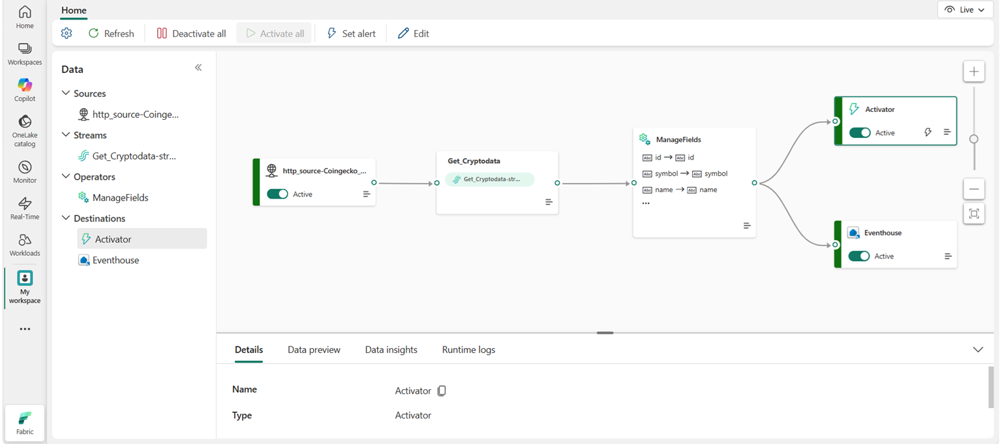
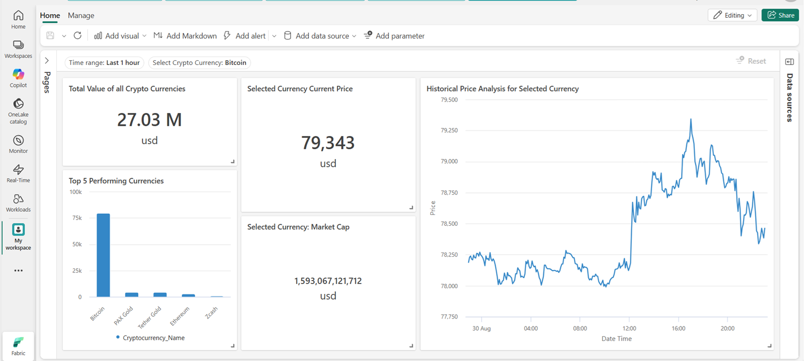

# Real-Time Cryptocurrency Data Pipeline (Microsoft Fabric)

A no-code/low-code real-time solution built in **Microsoft Fabric** that streams live cryptocurrency market data from the **CoinGecko API**.  An Eventstream then routes it to both an **Eventhouse** (for storage and analysis) and an **Activator** (for alerting). A **Real-Time Dashboard** on top of the Eventhouse visualises the data live. 

This solution is built to ingest data into the eventstream and kql database on an hourly basis. It tracks price changes in cryptocurrencies. The real time dashbaord uses a KQL base query and from that other KQL queries are scripted to build each of the visualiations on the dashboard (i.e. graphs, KPI cards etc.). The dashboard presents current and historical price tracking for all and individual cryptos based on a filter on the dashboard.

The activator step uses a stateful rule where if the value a specific cryptocurrency - in this case Bitcoin drops to £25k or lower, an alert to someone's email inbox and teams message is sent to let them know. This is particularly useful for an investor to make a timely decision on whether to invest in Bitcoin.  The rule can be adjusted depending on investors' risk profile, preferences and thier budget (25k and Bitcoin was just one example. We could have used other cryptos and minimum prices).


## Architecture



```
CoinGecko API → HTTP source → Get_Cryptodata (stream) → ManageFields → Eventhouse → Real-Time Dashboard
                                                                     └→ Activator
```

| Component | Type | Purpose |
|---|---|---|
| `http_source-Coingecko` | Eventstream source (HTTP) | Pulls cryptocurrency data from the CoinGecko API |
| `Get_Cryptodata` | Eventstream | Default stream carrying the incoming events |
| `ManageFields` | Operator | Selects and renames fields (e.g. `id`, `symbol`, `name`) and sets data types |
| `Eventhouse` | Destination | Stores the cleaned events for real-time querying with KQL |
| `Activator` | Destination | Monitors the stream and triggers alerts when conditions are met |

## Real-Time Dashboard



The dashboard reads from the Eventhouse and includes:

- **Total value of all cryptocurrencies** (USD)
- **Selected currency current price** and **market cap**
- **Top 5 performing currencies** (bar chart)
- **Historical price analysis** for the selected currency (line chart)
- Filters for **time range** (e.g. last 1 hour) and **cryptocurrency** (e.g. Bitcoin)

## How it works

1. The HTTP source calls the CoinGecko API and ingests the response as events.
2. The `ManageFields` operator keeps only the fields needed and standardises their names and types.
3. The transformed stream is sent to two destinations in parallel:
   - **Eventhouse** for storing and querying the data
   - **Activator** for setting alerts on the live data
4. The Real-Time Dashboard queries the Eventhouse with KQL and refreshes as new data arrives.

## Prerequisites

- A Microsoft Fabric workspace with Real-Time Intelligence enabled
- A Fabric capacity (trial or paid)
- Access to the CoinGecko API (a free or demo API key will be required)

## Setup

1. Create an **Eventstream** in your Fabric workspace.
2. Add an **HTTP** source and point it at the CoinGecko endpoint you want to use.
3. Add a **Manage fields** operator and select the columns to keep.
4. Add an **Eventhouse** destination and map it to a KQL database table.
5. Add an **Activator** destination and define your alert rules (e.g. a price crossing a threshold).
6. Publish the Eventstream and confirm both destinations show **Active**.
7. Create a **Real-Time Dashboard**, add the Eventhouse as a data source, and build tiles with KQL queries plus time range and currency parameters.

## Example use cases

- Track live prices and market data for selected coins
- Query historical snapshots in the Eventhouse using KQL
- Get notified when a coin moves past a price or percentage threshold
- Build a Real-Time Dashboard or Power BI report on top of the Eventhouse

## Tech stack

- Microsoft Fabric Real-Time Intelligence
- Eventstream, Eventhouse (KQL database), Activator, Real-Time Dashboard
- CoinGecko API
- KQL

## Author

- Asif Shah